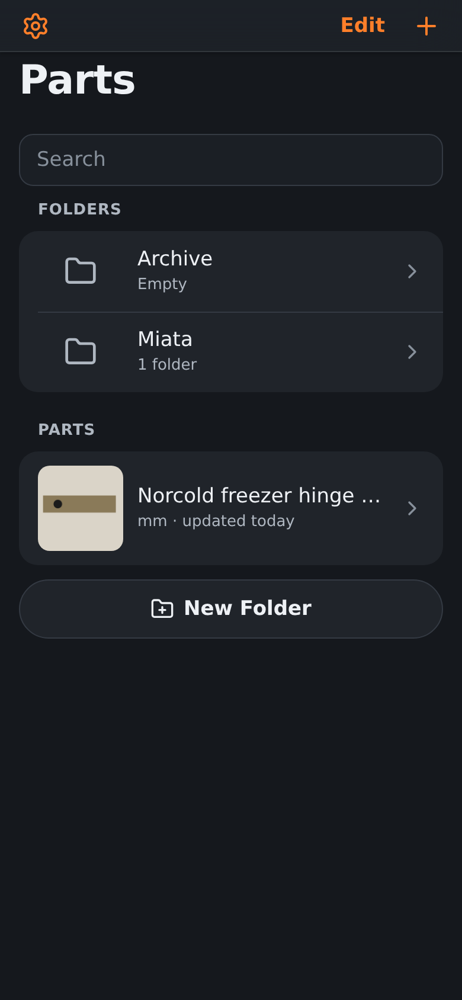
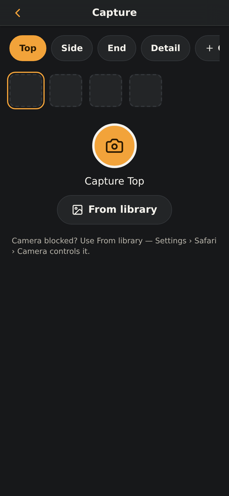
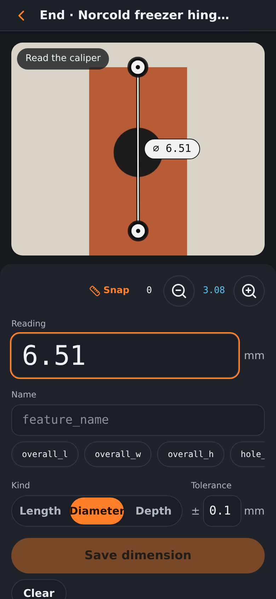
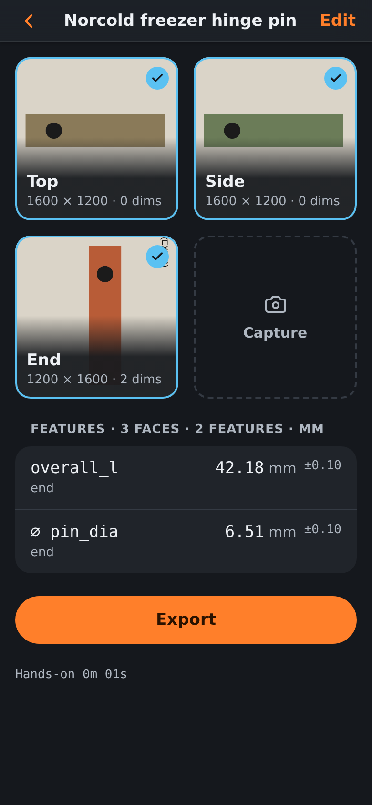

**Calipers in. CAD out.** Photograph each face of a part, tap two edges, read your caliper, name the
feature. Snapkin keeps every number on a dimensioned photo and exports a `features.json` and a
`parameters.csv` for Fusion. The photo is never measured: the caliper is the only source of numbers.

<p>




</p>

- **Landing page:** [`m0n01d/napkin-site`](https://github.com/m0n01d/napkin-site) → https://snapkin.tools
- **App:** this repo's Pages site → https://app.snapkin.tools (https://m0n01d.github.io/caliper-companion/ redirects there)
- **Brand kit:** `docs/brand/` (lockups, icon, colours, voice)

## About the name

Repo `caliper-companion` — the product is **Snapkin** (renamed 2026-09-18): snap a photo, jot the
dimensions on it like a napkin sketch, export to Fusion. Older docs and the `features.json` schema
id keep the old name on purpose (the export contract and the on-device database name never change).
Annotated-photo caliper capture for reverse engineering small parts. Exports features.json for the Fusion 360 MCP.


*Mark two edges on the photo. Type the caliper reading.*

## Develop

```sh
npm install
npm run dev          # ReScript watch + Vite on :3000
npm test             # ReScript build + vitest (core/ + store/ unit tests)
npm run e2e          # build + Playwright (Chromium; WebKit where its libs exist)
```

## Test on a phone (GitHub Pages)

`.github/workflows/pages.yml` builds and publishes `dist/` to GitHub Pages on every push to `main`
or a `claude/**` branch. Pages serves it at the root of `https://app.snapkin.tools/`, and
`https://m0n01d.github.io/caliper-companion/` redirects there. iOS needs HTTPS for the service
worker, `navigator.share`, and the DeviceOrientation permission prompt, so this is the route for
real-device testing. Repo settings it depends on (already set): Pages › Source = GitHub Actions,
and the `github-pages` environment allows `claude/*` branches to deploy.

The build is path-independent. `vite.config.js` uses Vite's relative base (`./`) and routing is
hash-based, so one `dist/` works at `/` and under a subfolder such as `/caliper-companion/`. The
service worker reads its base from its own URL at run time. The workflow still sets `VITE_BASE`,
and the build ignores it on purpose (LOGBOOK 2026-10-01).

```sh
npm run build
npx vite preview --port 3000 --strictPort
node scripts/pages-smoke.mjs http://localhost:3000/       # SW scope + offline relaunch
node scripts/pages-smoke.mjs https://app.snapkin.tools/   # same, against the live site

# The same dist/ under a subfolder, served as static files:
rm -rf /tmp/sub && mkdir -p /tmp/sub && cp -R dist /tmp/sub/caliper-companion
python3 -m http.server 8000 -d /tmp/sub
node scripts/pages-smoke.mjs http://localhost:8000/caliper-companion/
```

## Import into Fusion without Claude

Every export bundle carries `parameters.csv` next to `features.json` (SPEC §8a A11), so you can get
a part's dimensions into Fusion 360 without the MCP skill at all:

1. Install [Parameter I/O](https://apps.autodesk.com/FUSION/en/Detail/Index?id=1801418194626000805)
   from the Fusion App Store (free, Autodesk's own add-in) — once per machine.
2. In Fusion: **Utilities → ParameterIO → Import**, then pick `parameters.csv` from the unzipped
   bundle. It creates a user parameter per feature (or updates one by name if it already exists),
   named and valued straight from the CSV — no manual typing.
3. Canvases are still manual: **Insert → Canvas**, one per face, using that face's
   `faces/<label>_dimensioned.png`.

The Claude skill (`docs/fusion/IMPORT-SKILL-SPEC.md`) does both of these steps automatically from
the same bundle — this path is for when Claude isn't in the loop.
